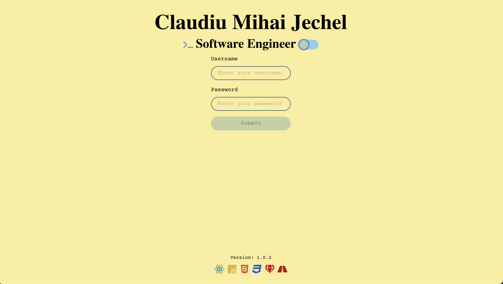
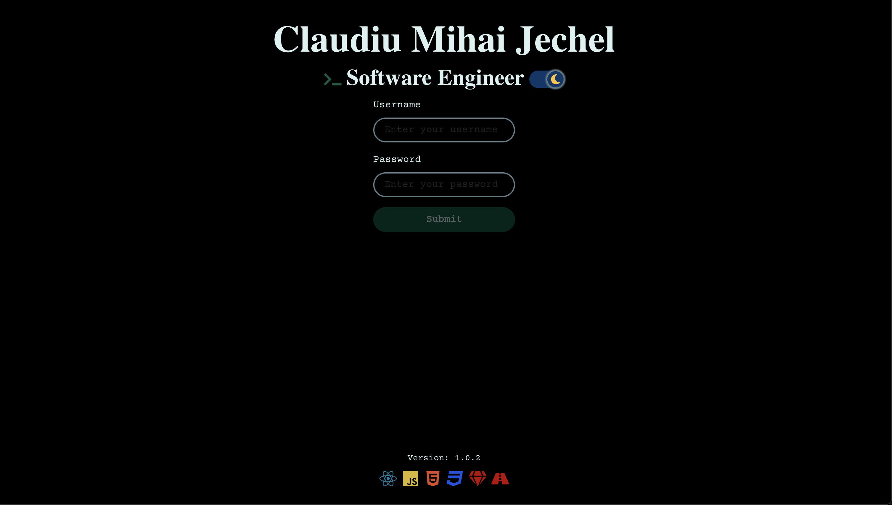
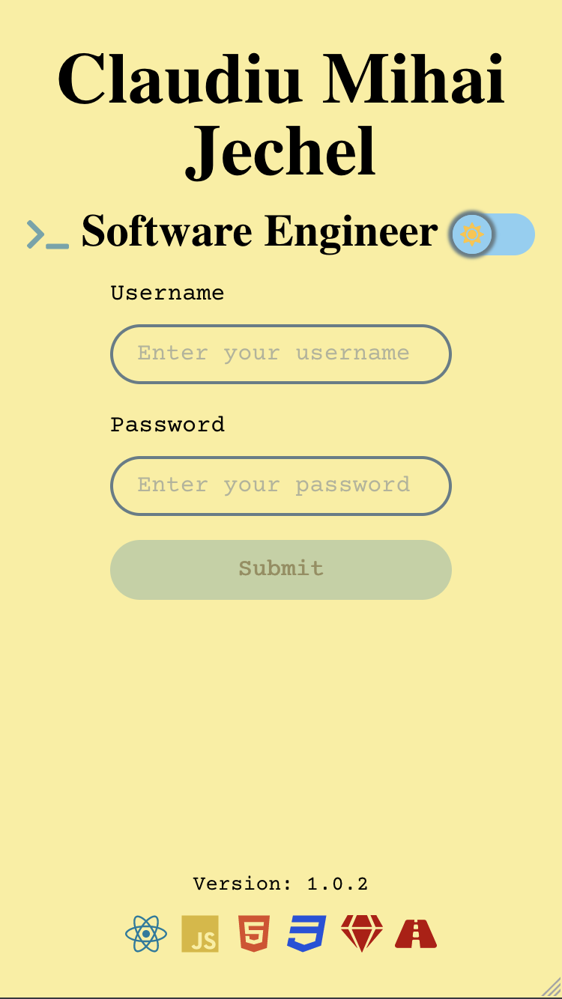
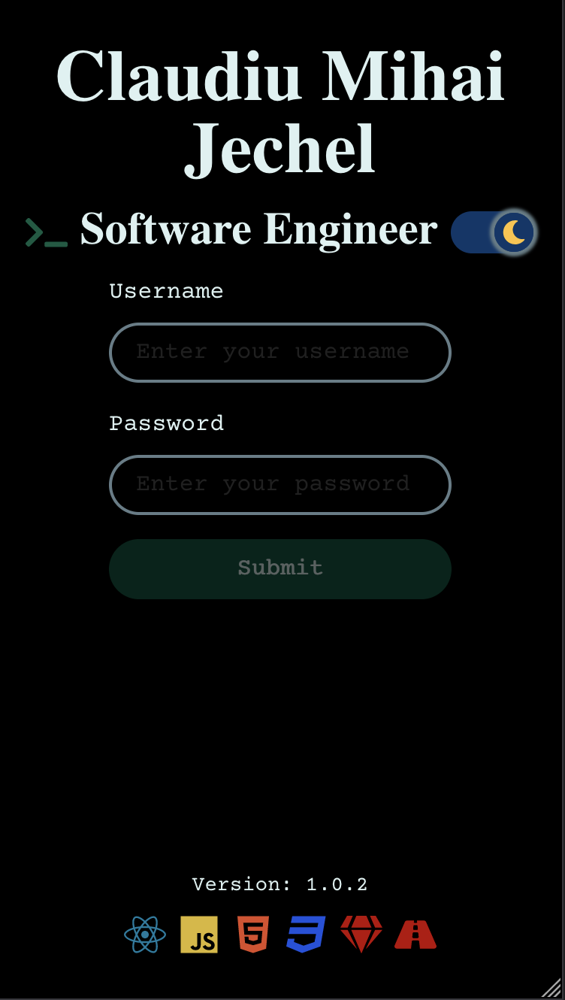

# [jechel.dev](https://jechel.dev/)

## Description
This is my website. I post updates on my work, achievements and hobbies.
***

## Screenshots
| Page | ```Light``` mode (```Desktop```) | ```Dark``` mode (```Desktop```) | ```Light``` mode (```Mobile```) | ```Dark``` mode (```Mobile```) |
| ---- | ---------- | --------- | ---------- | --------- |
| ```Login``` |  |  | |  |
| ```Website Loading``` |  | The same as for the ```light``` mode | | The same as for the ```dark``` mode |
***

## Tech Stack 
| Side | Tech |
| ---- | ---- |
| frontend | HTML, CSS, JavaScript, React, vite,  |
| backend | Ruby, Ruby on Rails, PostgreSQL|
| version control | git |

***

## Docs
- [YouTube Data API](https://github.com/googleapis/google-api-ruby-client/blob/main/generated/google-apis-youtube_v3/lib/google/apis/youtube_v3/service.rb#L3856)

***

## [Semantic versioning](https://semver.org/)
Version number: ```MAJOR.MINOR.PATCH```
Increase:
    - ```MAJOR``` version when you make incompatible API changes;
    - ```MINOR``` version when you add functionality in a backward compatible manner;
    - ```PATCH``` version when you make backward compatible bug fixes;

### Notes
- The ```PATCH``` version is automatically increased when a new commit occurs.

***

## Commands

- Install ```frontend``` dependencies
```console
npm install
```

- Start ```frontend``` development server
```console
npm run dev
```

- Install ```backend``` dependencies
```console
bundle install
```

- Start the ```backend``` rails server
```console
rails server
```

- Increase ```MINOR``` version
```console
npm run minor
```

- Increase ```MAJOR``` version
```console
npm run major
```

***

## To Do
### Sprint 1
- ~~Migrate to ```vite```~~
- ~~```Loading``` component~~
- ~~```Error``` component~~
- ~~```Current Version``` section on the bottom with ```automatic update```~~
- ~~Add detailed description about this project in the ```README``` file~~

### Sprint 2
- ```Moto``` section
    - ~~Create API to call from the frontend~~
    - ~~Get ```YT Videos``` details to ```backend``` by calling an ```API```~~
    - ~~Format data~~
    - ~~Integrate ```axios``` for ```API calls```~~
    - Display YT data on frontend

### Sprint 3
- ```Latest``` section
    - Compute the latest item and display it (moto for now)

### Sprint 4
- ```Admin``` page
    - ~~Login page~~
    - login setup (back end)
    - Edit ```About Me``` page
- ```About Me``` section (user)

### Sprint 5
- Cookies

### Sprint 6
- Dockerize
- Upload the browser's icon
- Host server on Heroku

### Next (to be divided into Sprints)
- Add the highschool education
- Under maintenance
- Contact form
- Subscribe to my email
- Websites
- Mobile apps
- Video games


## Issues
- [Color Mode Flash Issue](https://v2.chakra-ui.com/docs/styled-system/color-mode)
    - In some cases, when switching to dark mode and refreshing the page, the user might experience a quick flash of light mode before it switches correctly. This is a known issue and the ChakraUI team is looking to fix it.
***